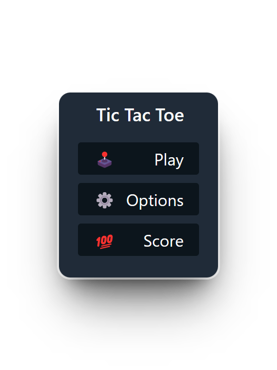
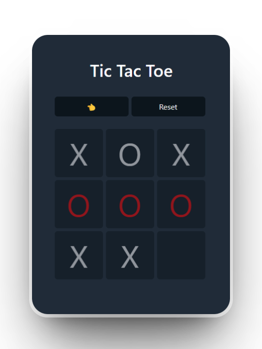

# Tic Tac Toe

[👆 Live Demo](https://tic-tac-toe-ai-nine.vercel.app/)

This is a simple tic-tac-toe game built with React and TypeScript. It includes an AI enemy that uses the `minimax` algorithm to play against the player.

## Features

- Lets you play tic-tac-toe
- Indicates when a player has won the game
- Includes an AI enemy using `minimax` algorithm

## Getting Started

### Prerequisites

- Node.js (v14 or higher)
- npm or pnpm

### Installation

1. Clone the repo: `git clone https://github.com/rivasjoaquin02/tic-tac-toe`
2. Install dependencies: `pnpm install`
3. Start the development server: `pnpm run dev`
4. Open http://localhost:3000 with your browser to see the result.

## Contributing

Contributions are welcome! Please see [CONTRIBUTING.md](CONTRIBUTING.md) for more details.

## License

This project is licensed under the MIT License - see the [LICENSE.md](LICENSE.md) file for details.